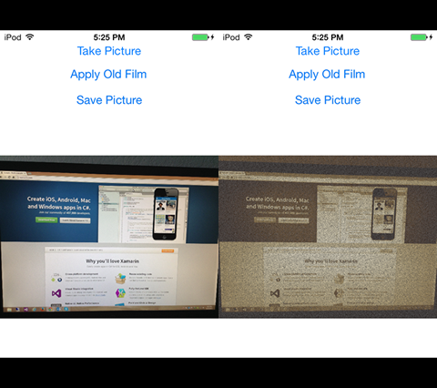

iOS.OldFilmFilter
=================

Xamarin.iOS recipe using Core Image Filters to apply an Old Film effect

Requirements
-------
1. iOS 7
1. Sample requires a camera and must be run on a device
2. Sample requires access to the Camera.

Screenshot
-------

Xamarin Components used
-------
1. Xamarin.Mobile - used to take picture with device camera.
   http://components.xamarin.com/view/xamarin.mobile/
